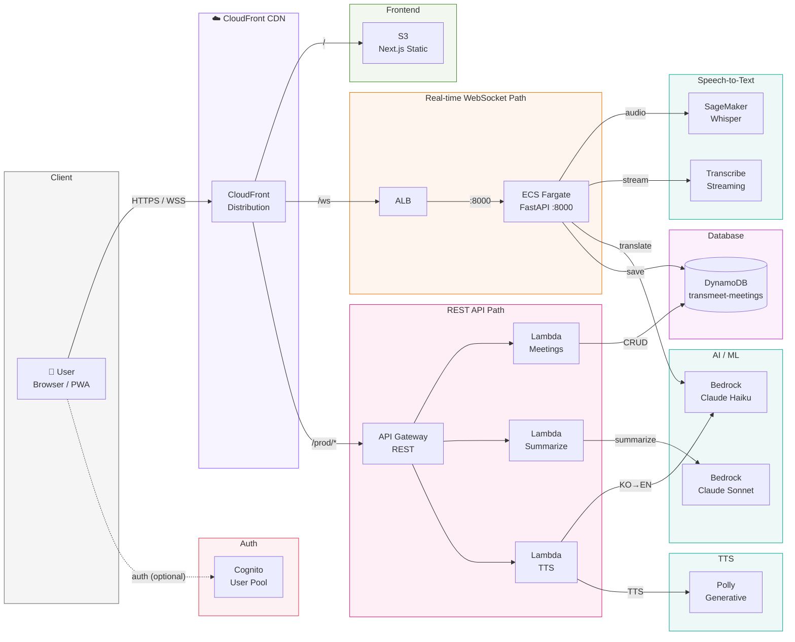

# TransMeet

글로벌 미팅에서 영어가 들릴 때, 바로 한글 자막이 뜨고 — 내가 한글로 입력하면, 영어 음성이 나간다.

TransMeet은 **실시간 음성 번역 웹앱**입니다. 영어 화자의 발화를 Whisper/Transcribe로 인식하고, Bedrock Claude로 즉시 한글 번역을 스트리밍합니다. 반대로 한글 텍스트를 입력하면 Polly가 자연스러운 영어 음성으로 변환해줍니다. 화자를 자동으로 구분하고, 대화 내용을 AI로 요약하며, 모든 회의 기록을 저장합니다.

브라우저만 열면 됩니다. PWA로 모바일에서도 설치 없이 사용할 수 있습니다.

### 주요 시나리오

- 🎙️ 영어 회의 참석 → 실시간 한글 자막으로 내용 파악
- ✍️ 한글로 의견 입력 → 영어 음성으로 회의에 참여
- 📋 회의 종료 → AI 요약으로 핵심 내용 정리
- 🔄 빠른 번역 팝업 → 회의 중 즉석으로 단어/문장 번역

## Features

- **실시간 STT** — 영어 음성 → 텍스트 (Whisper large-v3-turbo / Amazon Transcribe 선택 가능)
- **Transcribe 언어 토글** — 영어/한글 전환 가능 (Transcribe 모드)
- **실시간 번역** — 영어 ↔ 한글 양방향 번역 (Bedrock Claude Haiku / Sonnet)
- **스트리밍 번역** — 번역 진행 중 부분 텍스트 실시간 표시
- **화자 구분** — Speaker Diarization으로 화자별 메시지 분리
- **대화 요약** — 자동/수동 요약 생성 (Bedrock Claude Sonnet) + 글자 크기 조절
- **빠른 번역** — 글로벌 팝업으로 한→영 즉석 번역 + 번역 히스토리 관리
- **한→영 TTS** — 한글 입력 → 영어 음성 출력 (Polly Generative/Neural/Standard)
- **회의 기록** — 생성, 조회, 삭제 + 자동 제목 생성
- **설정 패널** — 오디오 소스, STT 프로바이더, 번역 타이밍, Polly 엔진 등 커스터마이징
- **인증** — AWS Cognito 기반 로그인/회원가입 (선택)
- **다크 모드** — 시스템 설정 감지 + 수동 전환
- **PWA** — 모바일 설치 가능, 오프라인 UI 지원

## Tech Stack

- **Frontend:** Next.js 14 (App Router, Static Export, PWA)
- **STT:** AWS SageMaker (Whisper large-v3-turbo) / Amazon Transcribe
- **Translation/Summary:** AWS Bedrock (Claude Haiku — 번역, Claude Sonnet — 요약)
- **TTS:** AWS Polly (Generative / Neural / Standard)
- **WebSocket:** ECS Fargate + ALB + CloudFront
- **Database:** AWS DynamoDB
- **Auth:** AWS Cognito
- **Hosting:** AWS S3 + CloudFront
- **IaC:** AWS CDK (TypeScript)

## Getting Started

```bash
# Install dependencies
npm install

# Copy environment variables
cp .env.example .env.local

# Run development server
npm run dev

# Build for production
npm run build

# Lint & format
npm run lint
npm run format
```

## Project Structure

```
src/
  app/
    layout.tsx                  # Root layout (PWA metadata, theme)
    page.tsx                    # Main page (상태 관리, WebSocket, 오디오 처리)
    globals.css                 # Global styles + Tailwind
  components/
    Header.tsx                  # 상단바 (녹음 상태, 테마 토글, 빠른 번역/요약 토글)
    VoiceArea.tsx               # 음성 입력 메시지 표시 (화자별 트랜스크립트 카드)
    NotesArea.tsx               # 메모/내 발화 영역 (접기/펼치기 지원)
    ChatArea.tsx                # 채팅 뷰
    ControlPanel.tsx            # 녹음/TTS 입력 컨트롤
    MeetingSidebar.tsx          # 회의 목록 & 생성
    SummaryPanel.tsx            # 요약 표시 (Markdown 렌더링 + 복사 + 글자 크기 조절)
    QuickTranslatePopup.tsx     # 글로벌 빠른 번역 팝업 (스트리밍 + 히스토리)
    SettingsPanel.tsx           # 앱 설정 패널
    AuthScreen.tsx              # Cognito 로그인/회원가입
    MobileTabBar.tsx            # 모바일 탭 네비게이션
    SubtitleArea.tsx            # 자막 표시 (레거시)
    ThemeProvider.tsx           # 다크 모드 프로바이더
  hooks/
    useWebSocket.ts             # WebSocket 연결 관리 (재연결, keepalive)
    useAudioCapture.ts          # 오디오 캡처 (마이크/시스템/둘 다)
    useSettings.ts              # localStorage 기반 설정 관리
    useQuickTranslateHistory.ts # 빠른 번역 히스토리 관리
    useSummaryResize.ts         # 요약 패널 리사이즈 핸들러
    useInterval.ts              # 유틸리티 훅
  lib/
    api.ts                      # REST API 클라이언트
    websocket.ts                # WebSocket 메시지 타입 정의
    cognito.ts                  # Cognito 인증 유틸리티
  context/
    AuthContext.tsx              # 인증 상태 Context
  types/
    meeting.ts                  # Message, Meeting, SpeakerRole 타입
backend/
  app/
    main.py                     # FastAPI 앱 엔트리포인트
    ws_handler.py               # WebSocket 오디오 파이프라인
    models.py                   # Pydantic 메시지 모델
    config.py                   # 환경 설정
    aws_clients.py              # AWS SDK 컨텍스트 매니저
    transcribe_session.py       # Amazon Transcribe 스트리밍 세션
  Dockerfile                    # Python 3.12 컨테이너
  requirements.txt              # Python 의존성
public/
  manifest.json                 # PWA manifest
  icons/                        # App icons
```

## Architecture

> draw.io 상세 다이어그램: [`docs/transmeet-architecture.drawio`](docs/transmeet-architecture.drawio)



### WebSocket 메시지 흐름

**Inbound (Client → Server):**

| Action | 설명 |
|--------|------|
| `sendAudio` | Base64 WAV 오디오 청크 전송 |
| `startRecording` | 녹음 시작 (meetingId, speaker, sttProvider 등 설정) |
| `stopRecording` | 녹음 중지 |
| `ping` | Keepalive |
| `summarize` | 요약 생성 요청 |
| `ttsRequest` | 한→영 TTS 요청 |
| `translateMessage` | 빠른 번역 요청 |

**Outbound (Server → Client):**

| Type | Phase | 설명 |
|------|-------|------|
| `subtitle_stream` | `stt_partial` | STT 부분 결과 |
| `subtitle_stream` | `stt` | STT 최종 결과 |
| `subtitle_stream` | `translating` | 번역 진행 중 (스트리밍) |
| `subtitle_stream` | `done` | 번역 완료 |
| `summary_stream` | `chunk` / `done` | 요약 스트리밍 |
| `tts_stream` | - | TTS 오디오 응답 |
| `pong` | - | Keepalive 응답 |

## Infrastructure (AWS CDK)

인프라는 `infra/` 폴더에 AWS CDK (TypeScript)로 구성되어 있습니다.

### AWS Resources

| 리소스 | 이름 | 용도 |
|--------|------|------|
| ECS Fargate | `transmeet-ws-cluster` | WebSocket 백엔드 (실시간 오디오 스트리밍) |
| ECR | `transmeet-ws-backend` | WebSocket 백엔드 컨테이너 이미지 |
| ALB | - | ECS 로드밸런싱 |
| API Gateway REST | `transmeet-api` | 회의 CRUD, 요약, TTS |
| Lambda | `transmeet-meetings` | 회의 생성/조회/삭제/제목 생성 |
| Lambda | `transmeet-summarize` | Bedrock Claude 요약 생성 |
| Lambda | `transmeet-tts` | Bedrock 번역 + Polly TTS |
| DynamoDB | `transmeet-meetings` | 회의 기록 저장 |
| S3 | `transmeet-frontend-{account}` | 프론트엔드 정적 호스팅 |
| CloudFront | - | CDN 배포 + WebSocket `/ws` 라우팅 |
| Cognito | `transmeet-users` | 사용자 인증 (선택) |

### REST API Endpoints

```
POST   /meetings                 # 회의 생성
GET    /meetings                 # 회의 목록
GET    /meetings/{id}            # 회의 상세
DELETE /meetings/{id}            # 회의 삭제
POST   /meetings/{id}/summarize  # 요약 생성
POST   /meetings/{id}/title      # 자동 제목 생성
POST   /tts                      # 한→영 번역 + TTS
```

### WebSocket

CloudFront `/ws` 경로를 통해 ECS Fargate 백엔드에 WebSocket 연결합니다.

```
Client → wss://{CloudFront}/ws → ALB → ECS Fargate (포트 8000)
```

### Deploying Infrastructure

```bash
# Prerequisites
npm install -g aws-cdk
aws configure  # AWS credentials 설정

# CDK bootstrap (최초 1회)
cd infra && npx cdk bootstrap

# 인프라만 배포
./deploy.sh infra

# 프론트엔드만 배포
./deploy.sh frontend

# 전체 배포
./deploy.sh all

# 변경사항 미리 보기
./deploy.sh diff

# 인프라 삭제
./deploy.sh destroy
```

### Infrastructure Directory

```
infra/
  bin/
    transmeet.ts        # CDK app entry point
  lib/
    transmeet-stack.ts  # Main CDK stack
  lambda/
    meetings/           # CRUD + 제목 생성
    summarize/          # 요약 생성 (Claude Sonnet)
    tts/                # 한→영 번역 + Polly TTS
  package.json
  tsconfig.json
  cdk.json
```

## Backend (FastAPI)

Python FastAPI 기반 WebSocket 서버로, ECS Fargate에서 실행됩니다.

### 주요 기능

- **듀얼 STT** — Whisper (SageMaker) 또는 Amazon Transcribe 선택
- **화자 분리** — Transcribe의 Speaker Diarization (en-US 등 지원)
- **스트리밍 번역** — Bedrock Claude 스트리밍으로 부분 번역 실시간 전달
- **Hallucination 필터링** — 비언어적 소리, 구독 유도 문구 등 자동 제거
- **오디오 버퍼링** — WAV 청크 결합, 600ms 무음 감지 (Whisper 모드)
- **발화 병합** — 같은 화자의 연속 발화를 하나로 합치기 (2초 딜레이)

### Python Dependencies

```
fastapi==0.115.6
uvicorn[standard]==0.32.1
aioboto3==13.2.0
amazon-transcribe==0.6.4
pydantic-settings==2.7.0
```

## Environment Variables

```bash
# AWS Configuration
AWS_REGION=us-east-1
AWS_ACCESS_KEY_ID=your_access_key_id
AWS_SECRET_ACCESS_KEY=your_secret_access_key

# SageMaker Whisper
WHISPER_ENDPOINT=whisper-large-v3-turbo-004709

# Bedrock
BEDROCK_MODEL_ID=global.anthropic.claude-haiku-4-5-20251001-v1:0

# API Gateway REST
NEXT_PUBLIC_API_ENDPOINT=https://your-api-gateway-endpoint

# WebSocket (CloudFront /ws)
NEXT_PUBLIC_WS_ENDPOINT=wss://your-cloudfront-domain/ws

# Cognito (CDK 배포 후 설정)
NEXT_PUBLIC_COGNITO_USER_POOL_ID=us-east-1_xxxxxxxxx
NEXT_PUBLIC_COGNITO_CLIENT_ID=xxxxxxxxxxxxxxxxxxxxxxxxxx
NEXT_PUBLIC_COGNITO_REGION=us-east-1
```

## License

MIT
