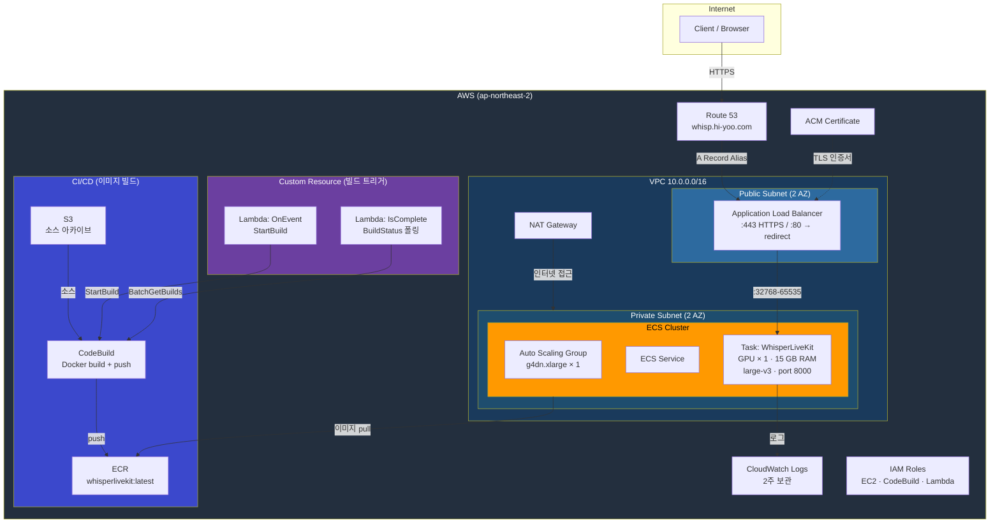
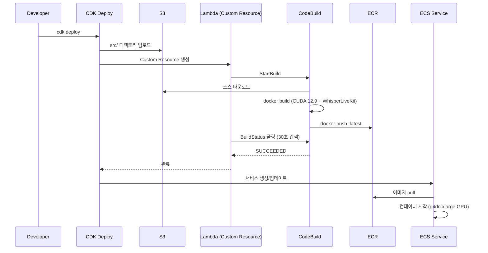

# WhisperLiveKit CDK

[WhisperLiveKit](https://github.com/QuentinFuxa/WhisperLiveKit) 실시간 음성 전사 서버를 AWS에 배포하는 CDK 스택입니다.

## 아키텍처

### 전체 구조



### 배포 흐름



## AWS 서비스 목록

| 서비스 | 용도 | 세부 설정 |
|---|---|---|
| **VPC** | 네트워크 격리 | `10.0.0.0/16`, 퍼블릭/프라이빗 서브넷 × 2 AZ, NAT Gateway 1개 |
| **ECR** | 컨테이너 이미지 저장소 | `whisperlivekit` 리포지토리, 스택 삭제 시 자동 정리 |
| **S3** | 소스 코드 아카이브 | CDK Asset으로 `src/` 업로드 → CodeBuild 입력 |
| **CodeBuild** | Docker 이미지 빌드 | STANDARD_7_0, privileged, LARGE 컴퓨트, 30분 타임아웃 |
| **Lambda** | 빌드 트리거/폴링 | `OnEvent`(StartBuild) + `IsComplete`(30초 간격 폴링) |
| **ECS (EC2)** | 컨테이너 오케스트레이션 | EC2 Launch Type, BRIDGE 네트워크, Circuit Breaker 활성화 |
| **EC2 Auto Scaling** | GPU 인스턴스 관리 | `g4dn.xlarge` × 1, ECS-optimized AMI (GPU), 100 GB gp3 |
| **ALB** | 로드 밸런싱 + TLS 종료 | HTTPS(:443) + HTTP→HTTPS 리다이렉트, 24시간 세션 고정 |
| **ACM** | TLS 인증서 | 기존 인증서 ARN 참조 |
| **Route 53** | DNS 관리 | `whisp.hi-yoo.com` → ALB Alias A 레코드 |
| **CloudWatch Logs** | 컨테이너 로그 | `wlk` 프리픽스, 2주 보관 |
| **IAM** | 권한 관리 | EC2 인스턴스 역할(ECS + SSM), CodeBuild 역할, Lambda 역할 |
| **CloudFormation** | IaC 배포 | CDK가 생성하는 Custom Resource Provider 포함 |

## 사전 요구사항

- AWS CLI 및 자격 증명 설정
- Node.js 및 AWS CDK CLI (`npm install -g aws-cdk`)
- Python 3.8+
- CDK Bootstrap 완료 (`cdk bootstrap`)

## 설치 및 배포

```bash
# 의존성 설치
pip install -r requirements.txt

# 스택 확인
cdk synth

# 배포
cdk deploy
```

## 프로젝트 구조

```
whisperlivekit-cdk/
├── app.py                  # CDK 앱 엔트리포인트
├── cdk.json                # CDK 설정
├── requirements.txt        # CDK 의존성
├── stacks/
│   └── whisperlivekit_stack.py  # 인프라 정의 (VPC, ECS, ALB 등)
└── src/                    # WhisperLiveKit 소스 (Docker 빌드 컨텍스트)
    ├── Dockerfile          # GPU 런타임 이미지 (CUDA 12.9)
    ├── pyproject.toml
    └── whisperlivekit/     # 애플리케이션 코드
```

## 커스터마이징

### Whisper 모델 변경

`stacks/whisperlivekit_stack.py`의 ECS 컨테이너 command를 수정합니다:

```python
command=["--model", "large-v3", "--language", "auto"],
```

### 인스턴스 타입 변경

동일 파일의 ASG 설정에서 변경합니다:

```python
instance_type=ec2.InstanceType("g4dn.xlarge"),
```

### 도메인/인증서 변경

스택 내 ACM 인증서 ARN과 Route 53 호스팅 영역 정보를 환경에 맞게 수정해야 합니다.
